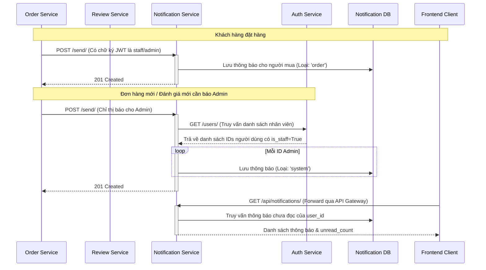

# Kế hoạch Tái cấu trúc Giao diện & Thiết kế Hệ thống Thông báo (UI Redesign & Notification System Plan)

Tài liệu này đóng vai trò là bản kế hoạch chi tiết từng bước (step-by-step) để tái cấu trúc, hiện đại hóa giao diện của hệ thống E-commerce hiện tại và kiến trúc lại Hệ thống thông báo đa dịch vụ (Multi-service Notification System).

---

## 🎨 1. Giao diện & Hệ thống Thiết kế (Design Tokens)

Việc thiết lập các Token này giúp đồng bộ hóa nền tảng hình ảnh và màu sắc trên toàn bộ ứng dụng.

### Bảng màu (Color Palette)
Từ bỏ các màu xanh dương kiểu cũ, chúng ta chuyển dịch sang hệ màu Đen/Xám đậm làm chủ đạo kết hợp với điểm nhấn màu Sky Blue để tôn lên hình ảnh sản phẩm.

| Tên Token | Vai trò | Mã Hex | Lớp Tailwind tương ứng | Ứng dụng cụ thể |
| :--- | :--- | :--- | :--- | :--- |
| **Primary** | Màu chính | `#0F172A` | `bg-slate-900` / `text-slate-900` | Nút "Thêm vào giỏ", Header tối màu, các icon và nút bấm chính. |
| **Accent** | Điểm nhấn | `#38BDF8` | `text-sky-400` / `bg-sky-400` | Tag "Freeship", huy hiệu giảm giá, các liên kết hoặc tab đang hoạt động. |
| **Surface** | Nền thẻ | `#FFFFFF` | `bg-white` | Nền của các thẻ (Card) sản phẩm, nền của giỏ hàng Drawer, dropdowns. |
| **Background**| Nền web | `#F8FAFC` | `bg-slate-50` | Nền của toàn bộ trang web (giúp nổi bật các thẻ màu trắng). |
| **Text Main** | Chữ chính | `#1E293B` | `text-slate-800` | Tiêu đề sản phẩm, chữ nội dung chính. |
| **Text Muted**| Chữ phụ | `#64748B` | `text-slate-500` | Giá gốc (gạch ngang), văn bản phụ, placeholder tìm kiếm. |

### Nghệ thuật chữ (Typography)
*   **Font Tiêu đề (Headings):** Sử dụng **Plus Jakarta Sans** tạo nét cắt sắc sảo, công nghệ và cao cấp. 
    *   *Lớp Tailwind:* `font-display`
*   **Font Nội dung (Body):** Giữ lại font **Inter** cho trải nghiệm đọc văn bản tốt nhất.
    *   *Lớp Tailwind:* `font-sans`

### Hình khối & Bóng đổ (Shape & Shadows)
*   **Bo góc (Border Radius):** 
    *   Nút bấm, ô nhập liệu: Chuyển sang bo góc cứng cáp hơn với `rounded-md` (6px).
    *   Thẻ sản phẩm, Gallery ảnh: Sử dụng `rounded-lg` (8px).
*   **Bóng đổ (Shadows):** 
    *   Thay vì dùng `shadow-md` mặc định của Tailwind, sử dụng custom shadow mờ và rộng hơn: `box-shadow: 0 10px 40px -10px rgba(0,0,0,0.04)`.

---

## 🛠️ 2. Các Bước Thực hiện Tái cấu trúc Giao diện

### Bước 1: Khởi tạo & Cấu hình Design Tokens
Đồng bộ các token thiết kế vào cấu hình hệ thống.
*   Cập nhật file `tailwind.config.js` để mở rộng bảng màu (`colors`), font chữ (`fontFamily`) và bóng đổ tùy chỉnh (`boxShadow`).
*   Cập nhật file `index.css` để nhập font **Plus Jakarta Sans** từ Google Fonts.

### Bước 2: Tái thiết kế Header & Navigation
Thay thế thanh điều hướng Tiki kiểu cũ bằng thiết kế Glassmorphism tối giản và hiện đại.
*   **File chỉnh sửa:** `Header.jsx`
*   Cập nhật CSS lớp bao ngoài Header sang dạng Sticky & Blur:
    `sticky top-0 z-50 w-full bg-white/80 backdrop-blur-lg border-b border-slate-100`
*   Cải tiến thanh tìm kiếm (Search Bar) ở giữa:
    *   Thu nhỏ chiều rộng ban đầu về `w-96` và lồng trong khối xám nhạt `bg-slate-100 rounded-full px-4 py-2 text-sm`.
    *   Thêm hiệu ứng co giãn: `focus-within:w-[32rem] focus-within:bg-white focus-within:shadow-md transition-all`.
*   Icon Giỏ hàng (Cart Icon): Sử dụng icon túi xách (`ShoppingBag`) và badge đỏ báo số lượng tối giản.

### Bước 3: Phát triển & Tích hợp Cart Drawer (Giỏ hàng trượt)
Chuyển đổi hoàn toàn việc chuyển hướng sang trang `/cart` sang ngăn kéo giỏ hàng (Drawer) trượt từ cạnh phải.
*   **File tạo mới:** `CartDrawer.jsx`
*   Thiết kế Container của Drawer: `fixed inset-y-0 right-0 z-[60] w-[400px] bg-white shadow-2xl transform transition-transform duration-300` kèm lớp phủ mờ (backdrop overlay) phía sau.

### Bước 4: Tái cấu trúc Trang Chi tiết Sản phẩm (Product Detail Page - PDP)
Thiết lập lại bằng lưới 2 cột theo chuẩn UX/UI quốc tế.
*   **File chỉnh sửa:** `ProductDetailPage.jsx`
*   Thay thế Grid Container cũ thành: `max-w-7xl mx-auto px-4 py-8 grid grid-cols-1 lg:grid-cols-12 gap-12`
*   **Cột Trái - Gallery hình ảnh (lg:col-span-7):** Sticky gallery khi cuộn trang, ảnh phụ được bo viền đen mỏng nổi bật.
*   **Cột Phải - Thông tin & Nút mua (lg:col-span-5):** Cỡ chữ tiêu đề lớn, bảng hiển thị giá bán và giá gốc rõ ràng, thay thế select dropdown biến thể sang các nút bấm bo dẹt (Pill buttons).

### Bước 5: Cải tiến Thẻ Sản phẩm (Product Card)
Xóa bỏ các đường viền cứng nhắc để tạo chiều sâu và độ mượt khi tương tác.
*   **File chỉnh sửa:** `ProductCard.jsx`
*   Sử dụng hiệu ứng phóng to nhẹ ảnh khi hover (`group-hover:scale-105`) và bóng đổ mịn màng.

---

## 🔔 3. Thiết kế Hệ thống Thông báo (Notification System Design)

Hệ thống thông báo được thiết kế theo kiến trúc Microservices để đảm bảo tính độc lập và khả năng phản hồi thời gian thực, phục vụ cả Người mua (Buyers) và Quản trị viên (Admins).

### 3.1 Sơ đồ Kiến trúc & Luồng Dữ liệu (Architecture & Data Flow)



### 3.2 Thiết kế Tương tác ở Phía Backend (Service Integration)

Các dịch vụ gửi thông báo đến `notification-service` thông qua các yêu cầu HTTP POST được ký số (signed) bằng một mã JWT nội bộ sử dụng chung `JWT_SECRET` từ `.env`. JWT payload chứa claims `is_staff: True` giúp vượt qua cơ chế bảo mật phân quyền.

#### Các sự kiện kích hoạt (Event Triggers):
1.  **Đặt hàng thành công (Order Placed):**
    *   *Người nhận:* Người mua & Toàn bộ Admin.
    *   *Tiêu đề:* `Đơn hàng được đặt thành công` / `Đơn hàng mới được đặt`.
    *   *Loại:* `order` / `system`.
2.  **Cập nhật trạng thái vận chuyển (Order Shipped):**
    *   *Người nhận:* Người mua.
    *   *Tiêu đề:* `Đơn hàng đã cập nhật trạng thái`.
    *   *Loại:* `shipping`.
3.  **Hoàn thành đơn hàng & Xác nhận đã nhận hàng (Order Completed):**
    *   *Người nhận:* Người mua & Toàn bộ Admin.
    *   *Tiêu đề:* `Đơn hàng đã hoàn thành` / `Khách hàng đã nhận hàng`.
    *   *Loại:* `order` / `system`.
4.  **Đánh giá sản phẩm mới (New Product Review):**
    *   *Người nhận:* Toàn bộ Admin.
    *   *Tiêu đề:* `Đánh giá sản phẩm mới`.
    *   *Loại:* `system`.

### 3.3 Thiết kế Giao diện Phía Frontend (Frontend Components)

1.  **Thành phần `NotificationDropdown`:**
    *   Được tích hợp vào Header khách hàng (giao diện sáng) và Header của Admin Dashboard (giao diện tối).
    *   Tự động tải lại (polling) dữ liệu mỗi 30 giây để cập nhật số lượng thông báo mới mà không cần F5.
    *   Badge số lượng màu đỏ có hiệu ứng nhấp nháy nhẹ (`animate-pulse`) khi có thông báo chưa đọc.
    *   Mỗi thông báo hiển thị kèm Icon và Màu nền tương ứng với loại thông báo (Đơn hàng: Túi xách xanh dương, Thanh toán: Thẻ tín dụng xanh lá, Vận chuyển: Xe tải màu tím, Khuyến mãi: Hộp quà màu vàng).
    *   Hỗ trợ bấm để đánh dấu đã đọc và chuyển hướng nhanh tới trang chi tiết của đơn hàng/sản phẩm tương ứng.
    *   Tích hợp nút "Đọc tất cả" nhanh và nút xóa từng thông báo tiện lợi.

2.  **Trang danh sách thông báo chính (`ProfilePage.jsx` Tab Thông báo):**
    *   Bố cục rộng rãi, hỗ trợ bộ lọc nhanh: *Tất cả thông báo* hoặc *Thông báo chưa đọc*.
    *   Cho phép xóa thông báo vĩnh viễn khỏi danh sách và đánh dấu đọc tất cả.
    *   Giao diện Empty State được trau chuốt tỉ mỉ khi không có thông báo nào.

---

## 📈 4. Kế hoạch Kiểm thử & Đánh giá Giao diện mới

Để đảm bảo chất lượng giao diện sau khi tái thiết kế, quy trình kiểm thử sẽ tập trung vào các mặt sau:

1.  **Tính phản hồi (Responsive Design):** 
    *   Đảm bảo bố cục 2 cột của PDP chuyển đổi mượt mà sang 1 cột trên các thiết bị di động (Mobile).
    *   Chiều rộng của Cart Drawer co giãn hợp lý (tối đa `w-[400px]` trên Desktop và chiếm toàn màn hình hoặc `w-full` trên Mobile).
2.  **Tương tác (Interaction & Animation):**
    *   Đảm bảo hiệu ứng co giãn của thanh tìm kiếm và chuyển động trượt từ phải sang của Cart Drawer diễn ra với tốc độ ổn định (khoảng 300ms), không giật lag.
3.  **Tương thích Trình duyệt (Browser Compatibility):**
    *   Kiểm tra tính năng `backdrop-blur-lg` của Header trên Safari và các trình duyệt Chrome/Firefox cũ.

---

## 💡 5. Đề xuất Kỹ thuật & Cải tiến Trải nghiệm (Technical & UX Proposals)

*   **Đề xuất 1: Tránh xung đột CSS khi tùy biến Ant Design:** Tự phát triển một component **Accordion tối giản** bằng React State và Tailwind CSS thay vì dùng Ant Design Collapse.
*   **Đề xuất 2: Tối ưu hóa Trải nghiệm Thêm vào Giỏ hàng:** Tự động trượt **Cart Drawer** từ phải sang ngay khi bấm thêm sản phẩm để người dùng nhìn thấy sản phẩm vừa được nạp vào giỏ.
*   **Đề xuất 3: Khắc phục tỉ lệ Ảnh Sản phẩm (Aspect Ratio) trên Thẻ:** Sử dụng `object-contain` kết hợp với màu nền xám nhạt `bg-slate-50` để đảm bảo ảnh sản phẩm luôn hiển thị nguyên vẹn, không bị biến dạng.
*   **Đề xuất 4: Đảm bảo kích thước vùng chạm (Touch Target) trên Mobile:** Đảm bảo vùng click/tap của các nút bấm đạt tối thiểu **40px x 40px** (khuyến nghị **44px x 44px**) để tránh bấm nhầm.
*   **Đề xuất 5: Xây dựng cơ chế Fallback cho hiệu ứng Glassmorphism:** Thiết lập fallback màu nền đục hơn (`rgba(255, 255, 255, 0.95)`) đối với các trình duyệt không hỗ trợ hiệu ứng mờ kính.

---

## 💡 6. Thiết kế Trang Danh sách Sản phẩm theo Danh mục (Category-Only Listing Page)

Hệ thống E-commerce hiện đại (như Tiki, Shopee) không khuyến khích việc hiển thị danh sách "Tất cả sản phẩm" lộn xộn từ mọi ngành hàng khác nhau trên quy mô lớn (hàng trăm ngàn sản phẩm). Để tối ưu hóa hiệu năng tải trang, trải nghiệm người dùng (UX) và tối ưu hóa SEO, chúng tôi áp dụng thiết kế Trang Danh sách Sản phẩm chỉ hoạt động khi có ngữ cảnh Danh mục hoặc Tìm kiếm.

### 6.1 Nguyên tắc thiết kế (Core Rules):
1. **Loại bỏ Trang Tất cả sản phẩm chung chung:** Người dùng không thể xem một danh sách sản phẩm lộn xộn của toàn bộ hệ thống.
2. **Bắt buộc lựa chọn Danh mục:** Khi truy cập trang `/products` mà không chọn danh mục (không có `category` query param), hệ thống sẽ tự động điều hướng người dùng sang danh mục lớn (gốc) đầu tiên hiện có trong hệ thống (ví dụ: `/products?category=parent-id`).
3. **Cải tiến Breadcrumbs:** Breadcrumbs bắt đầu từ `Trang chủ` dẫn trực tiếp tới các cấp độ danh mục, loại bỏ nút trung gian "Tất cả sản phẩm".
4. **Cây danh mục Sidebar đồng bộ:** Sidebar bên trái chỉ render các danh mục phân cấp có icon và thụt lề, loại bỏ nút "Tất cả sản phẩm".

### 6.2 Sơ đồ luồng điều hướng (Navigation Flow):

```mermaid
graph TD
    A[Người dùng vào /products] --> B{Có tham số category?}
    B -- Có --> C[Tải sản phẩm của danh mục và các danh mục con]
    B -- Không --> D{categories.length > 0?}
    D -- Có --> E[Redirect sang /products?category=categories[0].id]
    D -- Không --> F[Tải danh sách categories từ API]
    F --> D
    C --> G[Hiển thị Breadcrumb: Trang chủ / Cha / Con]
```