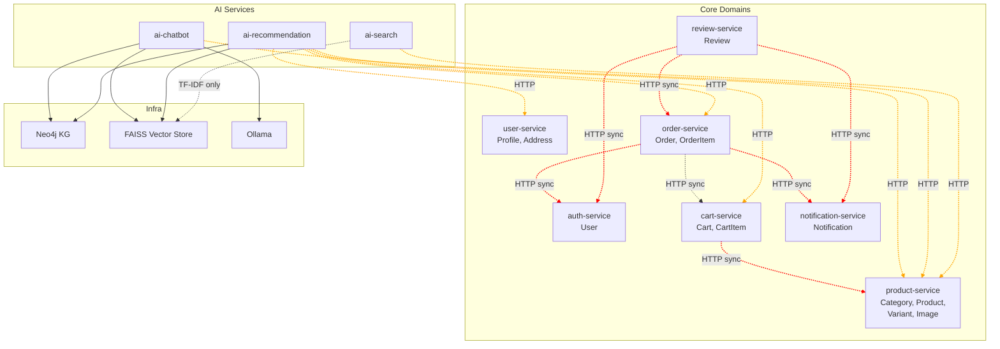
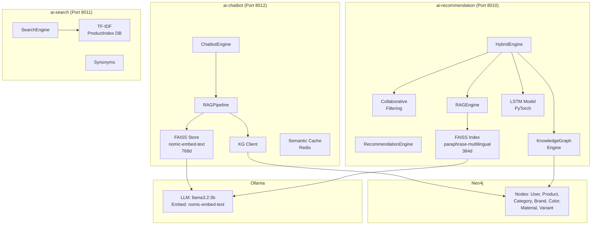
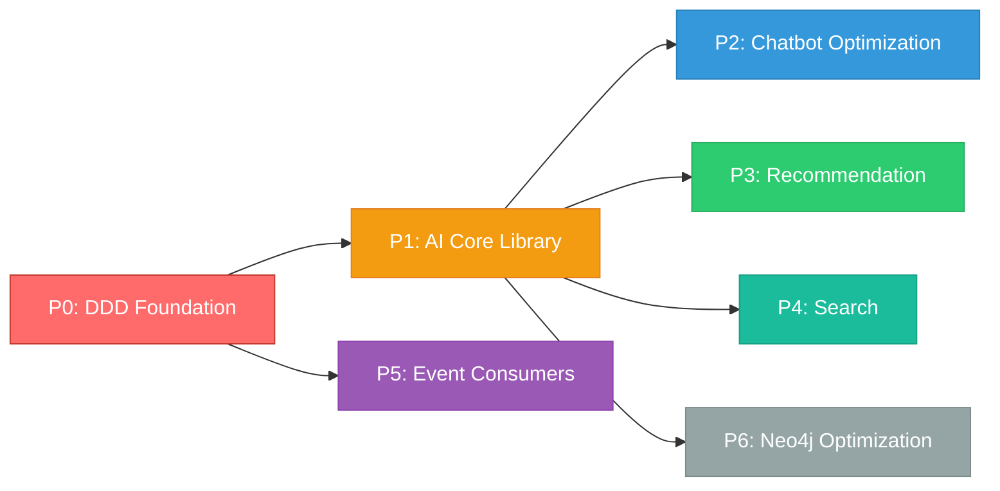

# Kế hoạch Tối ưu Hạ tầng & Kiến trúc AI

> **Mục tiêu:** Tối ưu RAG Chatbot, Recommendation System, Search Engine, và Knowledge Graph
> **Phạm vi:** services/ai-chatbot, services/ai-recommendation, services/ai-search, services/ai-analytics
> **Đánh giá DDD:** services/auth-service, services/user-service, services/product-service, services/cart-service, services/order-service, services/review-service, services/notification-service
> **Ngày:** 2026-06-13

---

## 0. Đánh giá Domain-Driven Design (DDD Assessment)

> **Kết luận:** Hệ thống đang ở mức **2/5** về DDD maturity. Có nền tảng bounded contexts nhưng thiếu aggregate roots, domain events, anti-corruption layer, và shared kernel.

### 0.1 Bounded Contexts — Ranh giới ngữ cảnh

#### ✅ Làm tốt
- Các service chính (Product, Cart, Order, Payment, Shipping, Review, Notification) có ranh giới rõ ràng, phản ánh đúng ngôn ngữ e-commerce
- Mỗi service có database riêng, deploy độc lập
- `verbose_name` tiếng Việt, field names tiếng Anh — song ngữ nhất quán

#### ❌ Vấn đề 1: auth-service và user-service bị tách giả tạo

**Phân tích:** `User` model (email, password, role) nằm ở auth-service, còn `Profile`, `Address`, `Wishlist` (cùng user_id) nằm ở user-service. Đây là **1 bounded context "Identity & Access" bị cắt làm đôi**.

**Hậu quả:**
- 5+ service tự implement authentication riêng (`JWTAuthentication`, `JWTUser`) — code duplication tràn lan
- `notification_helper.py` phải gọi HTTP tới auth-service chỉ để lấy danh sách admin
- Không có shared User read-model — mỗi service tự định nghĩa lại

```python
# Mỗi file authentication.py đều copy-paste logic JWT decode:
# services/review-service/review_app/authentication.py
# services/notification-service/notification_app/authentication.py
# etc.
```

#### ❌ Vấn đề 2: notification_helper.py nhân bản qua bounded context

```python
# Giống hệt nhau 99%:
# services/order-service/order_app/notification_helper.py
# services/review-service/review_app/notification_helper.py
```

Cả 2 file có cùng `send_notification()`, `notify_admins()`, thậm chí cùng hardcoded secret key `'your-secret-key-goes-here'`.

**Vấn đề DDD:** Notification-sending logic phải sống trong bounded context "Notification", không copy sang Order và Review.

---

### 0.2 Ubiquitous Language — Ngôn ngữ chung

#### ❌ Vấn đề: Price không nhất quán

```python
# product-service: Decimal(12, 0) — đúng
price = models.DecimalField(max_digits=12, decimal_places=0)

# chatbot/signals.py:45 — gửi sang chatbot thành float, mất precision
'price': float(product.price),

# service khác serialize Decimal thành string (DRF default)
```

#### ❌ Vấn đề: Address fields khác nhau giữa service

| Service | Fields |
|---------|--------|
| `order-service` | `shipping_province`, `shipping_district`, `shipping_ward`, `shipping_address` |
| `user-service/Address` | `province`, `district`, `ward`, `street_address` |

Cùng concept "địa chỉ" nhưng thiếu shared value object.

---

### 0.3 Domain Events — Sự kiện miền

#### ❌ Mức độ nghiêm trọng: 1/5

**Phát hiện:** Toàn bộ hệ thống có **17+ inter-service HTTP calls đồng bộ** nhưng chỉ có **1** nơi dùng event pattern (Django signals ở product-service).

```python
# signals.py:75-77 — Fire-and-forget daemon thread, KHÔNG reliable
thread = threading.Thread(target=notify_chatbot_async, args=(instance.id,))
thread.daemon = True
thread.start()
```

**Vấn đề:**
- Không có domain events class (không `ProductCreated`, `OrderPlaced`, `PaymentCompleted`)
- Daemon thread không đảm bảo delivery — nếu crash hoặc container shutdown, event mất vĩnh viễn
- Không có event store, không replay, không retry

**Ví dụ luồng synchronous hiện tại khi tạo Order:**
```
Request → order-service → cart-service (fetch cart)
                         → ai-recommendation (track purchase)
                         → notification-service (notify user)
                         → auth-service (find admins)
                         → cart-service (clear cart)
                         ← response
= 5 synchronous hops → user thấy 503 nếu bất kỳ service nào down
```

---

### 0.4 Anti-Corruption Layer (ACL) — Lớp chống nhiễm

#### ❌ Mức độ nghiêm trọng: 0.5/5

**Phát hiện:** AI services có **quá nhiều knowledge** về internal model của product-service:

```python
# chatbot/engine.py:1117-1185 — Biết quá chi tiết về Product model
@staticmethod
def _build_product_text(product: dict) -> str:
    # Biết category có thể là dict {name} hoặc string
    # Biết specifications là JSON dict
    # Biết variants có cấu trúc [{name, price, stock, attributes}]
    # Biết cách extract color, material từ raw text
    ...

# chatbot/tasks.py — Biết cả cách parse primary_image vs images[]
```

**Vấn đề DDD:** Nếu product-service thay đổi API (đổi field name, restructure response), tất cả AI services đều broken. Cần ACL để biến đổi dữ liệu trước khi vào bounded context.

---

### 0.5 Aggregates — Thực thể tổng hợp

#### ❌ Mức độ nghiêm trọng: 2/5

- **Cart + CartItem**: Aggregate root hợp lý, nhưng CartItem chỉ lưu `product_id` (UUID string) — không có FK tới Product → không có referential integrity
- **Product + ProductVariant**: Variant được signal riêng, có thể thay đổi độc lập với Product → vi phạm aggregate boundary
- **Order + OrderItem**: Item thao tác trực tiếp không qua Order → không có invariant enforcement

---

### 0.6 Service Autonomy & Coupling

**17+ synchronous HTTP paths giữa các service, không có:**
- ❌ Circuit breaker
- ❌ Bulkhead pattern
- ❌ Retry với exponential backoff
- ❌ Fallback caching
- ❌ Event bus

---

### 0.7 DDD Health Scorecard

| DDD Principle | Điểm | Key Issues |
|--------------|------|------------|
| **Bounded Context** | 3/5 | auth/user split, notification_helper copy |
| **Ubiquitous Language** | 3/5 | Price float vs Decimal, Address không shared |
| **Aggregate** | 2/5 | Không aggregate root rõ ràng, không invariant |
| **Domain Events** | 1/5 | Chỉ signals product-service, daemon thread unreliable |
| **Anti-Corruption Layer** | 0.5/5 | AI services consume raw JSON, không transformation |
| **Service Autonomy** | 2.5/5 | Sync coupling phá vỡ autonomy |
| **TOTAL** | **2/5** | **Cần refactor DDD trước hoặc song song** |

---

### 0.8 Sơ đồ Coupling hiện tại



---

## 1. Đánh giá Hiện trạng (Current State Analysis)

### 1.1 Vấn đề Kiến trúc

| Vấn đề | Mô tả | Mức độ |
|--------|-------|--------|
| **Dual FAISS/Embedding** | 2 vector store độc lập: chatbot (nomic-embed-text, 768d) và recommendation (sentence-transformers/TF-IDF, 384d) | 🔴 Nghiêm trọng |
| **Dual Neo4j Client** | 3 client kết nối Neo4j: `KnowledgeGraphEngine`, `KnowledgeGraphClient`, `neo4j_client.py` — code trùng lặp, config khác nhau | 🔴 Nghiêm trọng |
| **Không Anti-Corruption Layer** | AI services consume raw JSON từ product-service, biết quá chi tiết internal model | 🔴 Nghiêm trọng |
| **Sync HTTP blocking** | `_build_context` gọi review-service sync trong LLM generation | 🔴 Nghiêm trọng |
| **Không Domain Events** | 17+ sync HTTP paths thay vì event bus; daemon thread không reliable | 🔴 Nghiêm trọng |
| **auth/user split** | 1 bounded context bị cắt làm 2 service → authentication code tràn lan | 🟡 Trung bình |
| **Hybrid Engine cồng kềnh** | LSTM yêu cầu PyTorch + training data, hiếm khi dùng được | 🟡 Trung bình |
| **Search Service biệt lập** | ai-search dùng TF-IDF riêng, không share embedding với chatbot/recommendation | 🟡 Trung bình |
| **Dual Tracking** | `UserBehavior` (8 actions) + `UserInteraction` (5 types) — ghi đồng thời 2 bảng | 🟡 Trung bình |
| **notification_helper copy** | Order + Review service copy-paste cùng notification logic | 🟢 Thấp |

### 1.2 Sơ đồ Hiện tại (Before)



---

## 2. Kiến trúc Mục tiêu (Target Architecture)

### 2.1 Nguyên tắc

1. **Single Source of Truth** — Một vector store duy nhất, một Neo4j client duy nhất
2. **Unified Embedding** — Tất cả service dùng chung embedding model (nomic-embed-text, 768d)
3. **Event-Driven Communication** — Domain events qua RabbitMQ, không sync HTTP cho side effects
4. **Anti-Corruption Layer** — Mỗi AI service có ACL để transform data từ domain services
5. **Adaptive Weights** — Recommendation scores dựa trên real-time feedback, không static weights
6. **Shared Kernel** — Value objects dùng chung (Money, Address, UserId, ProductId)
7. **Async First** — Tất cả I/O (HTTP, Neo4j, FAISS) đều async

### 2.2 Sơ đồ Kiến trúc Mới (After)

```mermaid
graph TD
    subgraph "Shared Kernel (lib/shared/)"
        VO[Value Objects<br/>Money, Address, UserId, ProductId]
        EV[Domain Events<br/>ProductUpdated, OrderPlaced]
        AUTH[Auth Helper<br/>JWT decode, User read-model]
    end

    subgraph "Shared AI Core (lib/ai-core/)"
        UC[Unified Neo4j Client<br/>+ Anti-Corruption Layer]
        UV[Unified Vector Store<br/>FAISS + nomic-embed-text 768d]
        UM[Unified Embedder]
        SC[Semantic Cache<br/>Redis - LRU]
    end

    subgraph "AI Services (Ports 8010-8013)"
        CHAT[ai-chatbot<br/>RAGPipeline]
        REC[ai-recommendation<br/>HybridEngine v2]
        SRCH[ai-search<br/>SmartSearch v2]
        ANL[ai-analytics]
    end

    subgraph "Event Bus (RabbitMQ)"
        EB[product.events<br/>order.events<br/>user.events]
    end

    subgraph "Core Domain Services"
        PS[product-service]
        OS[order-service]
        AS[auth-user-service<br/>(merged)]
    end

    subgraph "Infrastructure"
        NEO4J[(Enhanced Neo4j<br/>+ Price Indexes)]
        OLLAMA[Ollama<br/>gemma2:9b + nomic-embed-text]
        PROM[Prometheus<br/>Metrics]
    end

    %% Event-driven: Core → Event Bus → AI
    PS -- "publish ProductUpdated" --> EB
    OS -- "publish OrderPlaced" --> EB
    EB --> CHAT
    EB --> REC
    EB --> SRCH

    %% AI → Core: ACL-protected queries
    CHAT --> UC --> NEO4J
    CHAT --> UV --> OLLAMA
    CHAT --> UM --> OLLAMA

    REC --> UC
    REC --> UV
    REC --> UM

    SRCH --> UC
    SRCH --> UV
    SRCH --> UM

    %% AI uses Shared Kernel
    CHAT -.-> VO
    REC -.-> VO
    SRCH -.-> VO

    %% Monitoring
    PROM --> CHAT
    PROM --> REC
    PROM --> SRCH

    linkStyle 8,9,10 stroke:green,stroke-width:2px;
```

---
## 3. Kế hoạch Chi tiết (Implementation Plan)

### Phase 0: 🏛️ DDD Foundation — Shared Kernel & Domain Events

**Mục tiêu:** Xây dựng nền tảng DDD trước khi refactor AI, đảm bảo AI services không tiếp tục build trên nền tảng thiếu vững.

**Effort:** 4-5 ngày | **Ưu tiên:** 🔴 Cao nhất (LÀM TRƯỚC)

---

#### Bước 0.1: Tạo `lib/shared/` — Shared Kernel

**Files tạo mới:**
```
lib/
├── shared/
│   ├── __init__.py
│   ├── value_objects.py       # Money, Address, UserId, ProductId
│   ├── domain_events.py       # Base DomainEvent, EventBus interface
│   ├── auth.py                # JWT decode helper, User read-model
│   └── exceptions.py          # Shared domain exceptions
│
├── ai-core/                   # (Phase 1)
│   ├── __init__.py
│   ├── embedder.py
│   ├── vector_store.py
│   ├── neo4j_client.py
│   ├── tracking.py
│   └── cache.py
```

**`lib/shared/value_objects.py`:**
```python
from dataclasses import dataclass
from decimal import Decimal
from uuid import UUID

@dataclass(frozen=True)
class Money:
    """Value Object: Tiền tệ — immutable, self-validating"""
    amount: Decimal
    currency: str = "VND"

    def __post_init__(self):
        if self.amount < 0:
            raise ValueError("Money amount cannot be negative")
        if self.currency not in ("VND", "USD"):
            raise ValueError(f"Unsupported currency: {self.currency}")

    def __add__(self, other: "Money") -> "Money":
        if self.currency != other.currency:
            raise ValueError("Cannot add different currencies")
        return Money(self.amount + other.amount, self.currency)

    def to_float(self) -> float:
        return float(self.amount)

    def to_neo4j(self) -> float:
        # Neo4j không support Decimal → cast to float
        return float(self.amount)


@dataclass(frozen=True)
class Address:
    """Value Object: Địa chỉ thống nhất toàn hệ thống"""
    province: str
    district: str
    ward: str
    street: str
    address_type: str = "home"  # home | office | other
```

**`lib/shared/domain_events.py`:**
```python
from dataclasses import dataclass, field
from datetime import datetime
from typing import Any, Dict
import uuid


@dataclass
class DomainEvent:
    """Base class cho tất cả domain events"""
    event_id: str = field(default_factory=lambda: str(uuid.uuid4()))
    event_type: str = ""
    timestamp: str = field(default_factory=lambda: datetime.utcnow().isoformat())
    data: Dict[str, Any] = field(default_factory=dict)
    version: int = 1


class ProductUpdated(DomainEvent):
    def __init__(self, product_data: dict):
        super().__init__(
            event_type="product.updated",
            data=product_data
        )


class ProductDeleted(DomainEvent):
    def __init__(self, product_id: str):
        super().__init__(
            event_type="product.deleted",
            data={"product_id": product_id}
        )


class OrderPlaced(DomainEvent):
    def __init__(self, order_data: dict):
        super().__init__(
            event_type="order.placed",
            data=order_data
        )


class EventBus:
    """Interface cho message broker — implementation RabbitMQ"""
    @staticmethod
    def publish(event: DomainEvent):
        """Publish event to RabbitMQ exchange"""
        ...

    @staticmethod
    def subscribe(event_type: str, handler):
        """Subscribe handler to event type"""
        ...
```

---

#### Bước 0.2: Consolidate auth — User Read Model

**Vấn đề:** auth-service và user-service là 1 bounded context bị cắt đôi.

**Giải pháp ngắn hạn (không merge DB):** Tạo shared User read-model trong `lib/shared/auth.py`:

```python
class UserReadModel:
    """
    User read-model dùng chung cho tất cả services.
    Cache local để tránh gọi HTTP tới auth-service mỗi lần.
    """
    @staticmethod
    def get_by_id(user_id: str) -> Optional[Dict]:
        """Lấy user từ cache hoặc auth-service API"""
        ...

    @staticmethod
    def get_admins() -> List[Dict]:
        """Lấy danh sách admin — cached 5 phút"""
        ...
```

**File ảnh hưởng:**
- Xóa `authentication.py` ở 5+ services → thay bằng `from lib.shared.auth import UserReadModel`
- Xóa duplicated `notification_helper.py` ở order + review → dùng event bus + notification-service API

---

#### Bước 0.3: Event Bus Setup — RabbitMQ Infrastructure

**Thay đổi ở Core Domain Services:**

```python
# product-service/signals.py — THAY THẾ daemon thread
from lib.shared.domain_events import ProductUpdated, ProductDeleted, EventBus

@receiver(post_save, sender=Product)
def handle_product_saved(sender, instance, created, **kwargs):
    # Publish domain event thay vì thread gọi HTTP
    EventBus.publish(ProductUpdated(serialize_product(instance)))

@receiver(post_delete, sender=Product)
def handle_product_deleted(sender, instance, **kwargs):
    EventBus.publish(ProductDeleted(str(instance.id)))
```

```python
# order-service/views.py — THAY THẾ sync notification calls
from lib.shared.domain_events import OrderPlaced, EventBus

class CreateOrderView(APIView):
    def post(self, request):
        order = self._create_order(request.user)
        # Publish event thay vì gọi notification + tracking sync
        EventBus.publish(OrderPlaced(serialize_order(order)))
        return Response(order_data, status=201)
```

**Consumers (ở AI services + notification-service):**
```python
@shared_task
def handle_product_updated(event_data):
    """Consume product.updated — update FAISS + Neo4j + SearchIndex"""
    unified_vector_store.add_product(event_data)
    unified_kg_client.add_product(event_data)
    search_engine.index_product(event_data)

@shared_task
def handle_order_placed(event_data):
    """Consume order.placed — track behavior + send notification"""
    tracker.track_purchase(event_data)
    notification_service.send_order_notification(event_data)
```

**Files ảnh hưởng:**
- `services/product-service/product_app/signals.py` — **SỬA**: daemon thread → EventBus.publish
- `services/order-service/order_app/views.py` — **SỬA**: sync HTTP → EventBus.publish
- `services/review-service/review_app/views.py` — **SỬA**: sync HTTP → EventBus.publish
- Tạo `services/ai-chatbot/chatbot_app/event_handlers.py` — **MỚI**
- Tạo `services/ai-recommendation/recommendation_app/event_handlers.py` — **MỚI**

---

#### Bước 0.4: Anti-Corruption Layer cho AI Services

**Tạo ACL để transform product-service data format:**

```python
# lib/ai-core/acl.py
class ProductACL:
    """
    Anti-Corruption Layer: Transform product-service response
    thành internal model của AI services.

    Nếu product-service thay đổi API, CHỈ sửa file này.
    """

    @staticmethod
    def from_api_response(raw: dict) -> dict:
        """Transform API response → AI internal format"""
        return {
            'id': str(raw['id']),
            'name': raw.get('name', ''),
            'price': Money(raw['price']).to_neo4j() if 'price' in raw else 0,
            'brand': raw.get('brand', ''),
            'category': ProductACL._extract_category(raw),
            'description': raw.get('description', ''),
            'image_url': ProductACL._extract_image(raw),
            'specifications': raw.get('specifications', {}),
            'variants': ProductACL._extract_variants(raw),
            'status': raw.get('status', 'active'),
            'stock': raw.get('stock_quantity', 0),
            'rating_avg': float(raw.get('rating_avg', 0)),
            'rating_count': raw.get('rating_count', 0),
        }

    @staticmethod
    def _extract_category(raw: dict) -> str:
        """Category có thể là dict {id, name}, string, hoặc None"""
        cat = raw.get('category')
        if isinstance(cat, dict):
            return cat.get('name', '')
        return str(cat) if cat else ''

    @staticmethod
    def _extract_image(raw: dict) -> str:
        """Image extraction logic tập trung tại đây"""
        ...

    @staticmethod
    def _extract_variants(raw: dict) -> list:
        """Variant parsing logic tập trung tại đây"""
        ...
```

**File ảnh hưởng:**
- `chatbot_app/engine.py` — Thay `_build_product_text()` dùng raw dict → dùng `ProductACL`
- `chatbot_app/tasks.py` — Dùng `ProductACL` thay vì tự parse
- `recommendation_app/engine.py` — Dùng `ProductACL`
- `search_app/engine.py` — Dùng `ProductACL`

---

### Phase 1: 🏗️ Unified AI Core Library

**Mục tiêu:** Consolidate tất cả shared AI components vào một thư viện dùng chung

**Effort:** 3-4 ngày | **Ưu tiên:** 🔴 Cao

#### Bước 1.1: Tạo `lib/ai-core/` package

**Files tạo mới:**
```
lib/ai-core/
├── __init__.py
├── embedder.py          # Unified TextEmbedder (nomic-embed-text)
├── vector_store.py      # Unified FAISS VectorStore
├── neo4j_client.py      # Unified KG Client (singleton)
├── tracking.py          # Unified Tracking Service
├── cache.py             # Semantic Cache (LRU)
└── acl.py               # Anti-Corruption Layer (từ Bước 0.4)
```

**File hiện tại sẽ thay thế/consolidate:**
- `chatbot_app/engine.py` → `ProductVectorStore`, `TextEmbedder`, `KnowledgeGraphClient` → **XÓA** (dùng từ ai-core)
- `recommendation_app/rag_engine.py` → `EmbeddingModel`, `FAISSIndex`, `RAGEngine` (phần embed) → **XÓA**
- `recommendation_app/knowledge_graph.py` → `KnowledgeGraphEngine` → **XÓA**
- `recommendation/services/neo4j_client.py` → **XÓA**

#### Bước 1.2: Unified Embedder — `embedder.py`

```python
"""
Unified Text Embedder for all AI services.
Sử dụng nomic-embed-text (768d) qua Ollama.
Fallback: sentence-transformers paraphrase-multilingual-MiniLM-L12-v2
"""
class UnifiedEmbedder:
    MODEL_NAME = "nomic-embed-text"
    EMBEDDING_DIM = 768

    def __init__(self):
        self.ollama_host = settings.OLLAMA_HOST
        self._sentence_model = None

    async def embed(self, texts, batch_size=10):
        """Async batch embedding via Ollama"""
        ...

    def embed_sync(self, texts):
        """Sync fallback using sentence-transformers or TF-IDF"""
        ...
```

**Tác động:**
- Tất cả service dùng chung embedding → consistent similarity search
- Batch async processing → performance improvement
- Giảm memory: 1 model thay vì 2 (sentence-transformers ~500MB)

#### Bước 1.3: Unified Vector Store — `vector_store.py`

```python
class UnifiedVectorStore:
    """
    Single source of truth cho product embeddings.
    - FAISS IndexFlatIP (768d) for cosine similarity
    - LRU cache + disk persistence
    - Async updates qua event bus
    - Filter tích hợp (status, stock, category)
    """
    def __init__(self):
        self.index = faiss.IndexFlatIP(768)
        self.product_ids = []
        self.product_data = {}

    async def search(self, query_emb, k=10, filters=None): ...
    async def add_product(self, product_id, embedding, data): ...
    async def bulk_index(self, products): ...
    def reload_if_changed(self): ...
```

**Cải tiến so với hiện tại:**
- Filter tích hợp (category, price range, brand)
- Disk watch auto-reload
- Add/update single product không rebuild full index

#### Bước 1.4: Unified Neo4j Client — `neo4j_client.py`

```python
class UnifiedKGClient:
    """
    Singleton pattern, dùng chung cho mọi AI services.
    Sử dụng ProductACL để đảm bảo data consistency.
    """
    _instance = None

    async def search_products(self, entities, n=5): ...
    async def get_user_recommendations(self, user_id, n=10): ...
    async def get_similar_products(self, product_id, n=10): ...
    async def get_frequently_bought_together(self, product_id, n=5): ...
    async def get_trending(self, n=10): ...
    async def add_product(self, product_data): ...  # Input qua ProductACL
    async def record_interaction(self, user_id, product_id, action, metadata=None): ...
```

#### Bước 1.5: Unified Tracking — `tracking.py`

```python
class UnifiedTracker:
    """Xóa dual-write UserBehavior + UserInteraction → chỉ UserBehavior"""

    @staticmethod
    async def track(user_id, action, product_id=None, category_id=None, metadata=None):
        # 1. Save to PostgreSQL (UserBehavior) — single table
        # 2. Update Neo4j graph (async via Celery)
        # 3. Invalidate relevant caches
        # 4. Update analytics counters
        ...
```

---

### Phase 2: 🔄 RAG Chatbot Optimization

**Effort:** 2-3 ngày | **Ưu tiên:** 🔴 Cao

#### Bước 2.1: Replace local FAISS/KG với Unified Core + ACL

**File sửa:** `chatbot_app/engine.py`

**Thay đổi:**
- `ProductVectorStore` → `from lib.ai_core.vector_store import UnifiedVectorStore`
- `TextEmbedder` → `from lib.ai_core.embedder import UnifiedEmbedder`
- `KnowledgeGraphClient` → `from lib.ai_core.neo4j_client import UnifiedKGClient`
- `_build_product_text()` → `from lib.ai_core.acl import ProductACL`
- Xóa ~600 lines code duplicated

#### Bước 2.2: Async context building — KHÔNG block LLM generation

**Vấn đề hiện tại:** `_build_context()` gọi `_fetch_review_stats()` **SYNC** trong vòng lặp products.

**Fix:**
```python
async def _build_context(self, products):
    """Async — fetch reviews in parallel, không block event loop"""
    tasks = [
        self._fetch_review_stats_async(p['product_id'])
        for p in products[:5]
    ]
    review_data = await asyncio.gather(*tasks, return_exceptions=True)
    ...
```

**Tối ưu hơn:** Lưu review stats vào product_data của vector store (update định kỳ qua event bus).

#### Bước 2.3: Cải tiến Semantic Cache

```python
class SemanticCache:
    def __init__(self, embedder):
        self.embedder = embedder
        self.threshold = 0.88  # Giảm từ 0.92 để tăng hit rate
        self.max_entries = 500

    def get(self, query):
        # Sử dụng Redis sorted set với similarity score
        # LRU eviction khi đầy
        ...
```

#### Bước 2.4: Guardrails nâng cao

```python
class Guardrails:
    @staticmethod
    def check_hallucination(response, context_products):
        """Check nếu AI mention product không có trong context"""

    @staticmethod
    def check_citation(response):
        """Ensure [ID: xxx] format cho mọi product được mention"""

    @staticmethod
    def check_safety(response):
        """Check nội dung độc hại, spam"""
```

---

### Phase 3: 🎯 Recommendation System Overhaul

**Effort:** 3-4 ngày | **Ưu tiên:** 🟡 Trung bình

#### Bước 3.1: HybridEngine v2 — Bỏ LSTM, thêm Online Learning

```python
class HybridEngineV2:
    """
    Hybrid Recommendation v2:
    1. Collaborative Filtering (Online: user-item cosine sim)
    2. Knowledge Graph (Neo4j queries)
    3. Content-Based (FAISS semantic similarity)
    4. Multi-Armed Bandit (exploration)

    Adaptive weights dựa trên:
    - User history density
    - Query specificity
    - Feedback CTR
    """

    def __init__(self):
        self.collab = CollaborativeFilter()
        self.kg_recommender = KGRecommender()
        self.content = ContentBasedRecommender()
        self.bandit = EpsilonGreedyBandit()

    async def recommend(self, user_id=None, query=None, product_id=None, n=10):
        user_state = await self._get_user_state(user_id)
        weights = self._compute_weights(user_state, query)
        candidates = await asyncio.gather(
            self.collab.recommend(user_id, n*2) if user_state != 'new' else None,
            self.kg_recommender.recommend(user_id, n*2),
            self.content.recommend(query, n*2) if query else None,
            self._get_exploration_items(user_id, n),
            return_exceptions=True
        )
        return self._merge_with_bandit(candidates, weights, n)
```

#### Bước 3.2: Multi-Armed Bandit

```python
class EpsilonGreedyBandit:
    def __init__(self):
        self.epsilon = 0.1  # 10% explore

    def should_explore(self, user_id):
        if user_id is None:
            return True  # Anonymous users always explore
        return random.random() < self.epsilon
```

#### Bước 3.3: Feedback Loop

```python
class FeedbackCollector:
    """
    Track CTR, dwell time, add-to-cart rate cho mỗi source.
    Dùng để điều chỉnh hybrid weights real-time.
    """
    async def record_feedback(self, user_id, product_id, source, action):
        # source: 'collab' | 'kg' | 'content' | 'popular' | 'exploration'
        # action: 'view' | 'click' | 'add_to_cart' | 'purchase' | 'dismiss'
        ...
```

---

### Phase 4: 🔍 Search Engine Modernization

**Effort:** 2-3 ngày | **Ưu tiên:** 🟡 Trung bình

#### Bước 4.1: SmartSearch v2 — Hybrid Search (Lexical + Semantic + Rerank)

```python
class SmartSearchV2:
    """
    Hybrid Search:
    1. Lexical (TF-IDF + Fuzzy + Synonym) → exact match
    2. Semantic (FAISS vector search) → meaning match
    3. Cross-Encoder Reranker → precision
    """

    async def search(self, query, filters=None, page=1, page_size=20):
        # 1. Parallel lexical + semantic
        lexical_task = asyncio.create_task(self.lexical.search(query, page_size*2))
        semantic_task = asyncio.create_task(self._semantic_search(query, page_size*2))
        lexical_results, semantic_results = await asyncio.gather(lexical_task, semantic_task)

        # 2. Reciprocal Rank Fusion merge
        merged = self._rrf_merge(lexical_results, semantic_results, k=60)

        # 3. Rerank top-K
        reranked = await self.reranker.rerank(query, merged[:20])

        return self._paginate(reranked, page, page_size)
```

---

### Phase 5: 📊 Cross-Service Optimization

**Effort:** 2 ngày | **Ưu tiên:** 🟢 Thấp

#### Bước 5.1: Event-Driven Product Sync (kế thừa từ Phase 0)

Sau khi Phase 0 setup EventBus, Phase 5 implement consumers:
```python
@shared_task
def handle_product_event(event):
    """Consume product.updated/product.deleted từ RabbitMQ"""
    vector_store = UnifiedVectorStore()
    kg = UnifiedKGClient()
    search = LexicalSearch()

    if event.event_type == "product.updated":
        data = ProductACL.from_api_response(event.data)
        vector_store.add_product(data['id'], embed(data), data)
        kg.add_product(data)
        search.index_product(data)
    elif event.event_type == "product.deleted":
        vector_store.remove_product(event.data['product_id'])
        kg.remove_product(event.data['product_id'])
        search.remove_product(event.data['product_id'])
```

#### Bước 5.2: Monitoring & Observability

```python
# Prometheus metrics
chatbot_latency = Histogram('chatbot_latency_seconds', '...', ['intent'])
rec_ctr = Gauge('recommendation_click_through_rate', '...', ['source'])
search_latency = Histogram('search_latency_seconds', '...')
```

---

### Phase 6: 🗄️ Neo4j Knowledge Graph Tối ưu

**Effort:** 1 ngày | **Ưu tiên:** 🟢 Thấp

#### Bước 6.1: Schema + Index

```cypher
CREATE INDEX product_price IF NOT EXISTS FOR (p:Product) ON (p.price);
CREATE INDEX product_status_price IF NOT EXISTS FOR (p:Product) ON (p.status, p.price);
```

#### Bước 6.2: Query tối ưu

```cypher
// BAD: toLower() prevents index usage
WHERE toLower(c.name) CONTAINS toLower($query)

// GOOD: name_lower field + index
CREATE INDEX category_name_lower IF NOT EXISTS FOR (c:Category) ON (c.name_lower);
WHERE c.name_lower CONTAINS $query_lower
```

---

## 4. Lộ trình Thực hiện (Timeline)

| Phase | Nội dung | Dependencies | Effort | Ưu tiên |
|-------|----------|-------------|--------|---------|
| **P0** | **DDD Foundation** — Shared Kernel, Event Bus, ACL, auth consolidation | Không | **4-5 ngày** | 🔴 Cao nhất |
| **P1** | Unified AI Core Library — ai-core package, xóa duplication | P0 (ACL) | 3-4 ngày | 🔴 Cao |
| **P2** | RAG Chatbot Optimization — async context, semantic cache | P1 | 2-3 ngày | 🔴 Cao |
| **P3** | Recommendation Overhaul — bỏ LSTM, bandit, feedback loop | P1 | 3-4 ngày | 🟡 TB |
| **P4** | Search Modernization — hybrid search, cross-encoder | P1 | 2-3 ngày | 🟡 TB |
| **P5** | Cross-Service — event consumers, monitoring | P0 (EventBus) | 2 ngày | 🟢 Thấp |
| **P6** | Neo4j Optimization — indexes, query tuning | P1 | 1 ngày | 🟢 Thấp |

**Tổng thời gian:** ~17-22 ngày (tăng 4-5 ngày so với plan cũ do thêm P0)

---

## 5. Dependency Graph giữa các Phase



---

## 6. Rủi ro & Mitigation

| Rủi ro | Impact | Mitigation |
|--------|--------|------------|
| Regression khi consolidate code | Cao | Từng bước nhỏ, test mỗi phase, feature flags |
| Event Bus introduce latency | TB | Local fallback: nếu RabbitMQ down → gọi sync HTTP |
| auth-service/user-service merge | Cao | Chỉ merge read-model trước, DB merge sau |
| notification_helper thay đổi | Thấp | Atomic change: deploy notification template trước |
| Team unfamiliar với DDD patterns | TB | Code review + pair programming phase đầu |
| Embedding dimension change (384→768) | TB | Re-index toàn bộ products, A/B test similarity quality |

---

## 7. Success Metrics

| Metric | Current | Target | How to measure |
|--------|---------|--------|----------------|
| **DDD Maturity** | 2/5 | 4/5 | DDD Health Scorecard review |
| **Code Duplication** | ~1500 LOC shared | <200 LOC shared | Lines of code diff |
| **Sync HTTP paths** | 17+ | <5 (chỉ query, không side-effect) | Code review |
| **Chatbot latency (p95)** | ~11s | <5s | Prometheus |
| **Chatbot cache hit rate** | ~30% | >60% | Semantic cache stats |
| **Recommendation CTR** | N/A | >15% | FeedbackCollector |
| **Search relevance (NDCG@10)** | N/A | >0.7 | Manual eval + click model |
| **Product sync delay** | ~30s (thread) | <5s (event-driven) | RabbitMQ monitoring |
